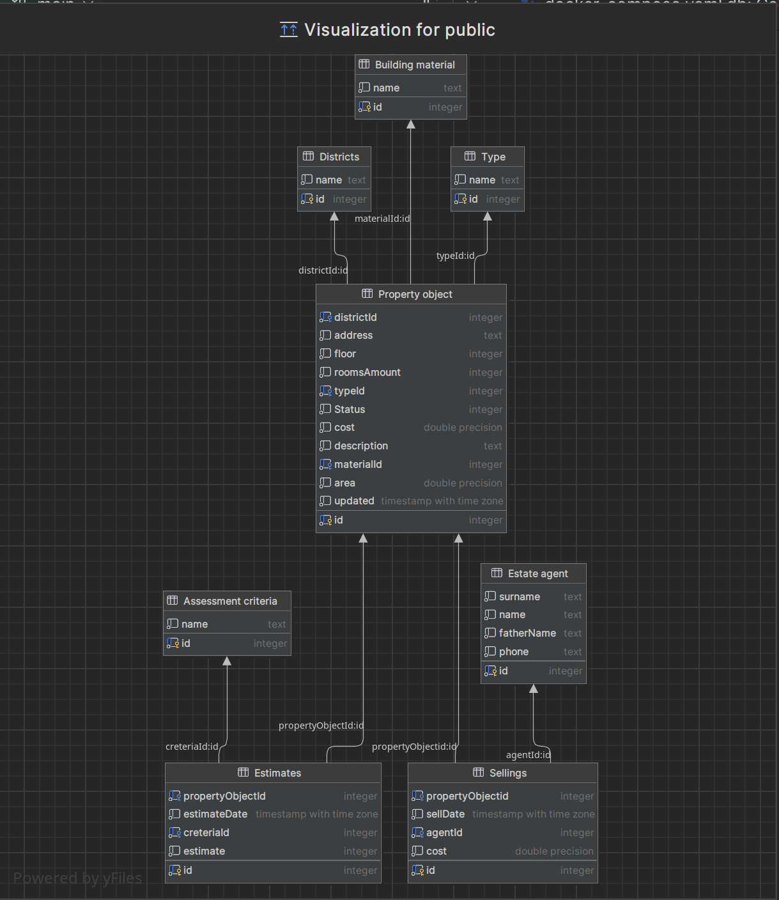

# entity-framework-cli

## Содержание
- [Перед запуском](#перед-запуском)
- [Проведение миграций](#проведение-миграций)
- [Схема базы данных](#схема-базы-данных)
- [Решение проблем](#решение-проблем)

## Перед запуском
1. Создайте файл `.env` по примеру из `.env.template`
2. Разверните бд как вам удобно локально или в [докер](#разворачиваение-докер-композ)
3. Проверьте что dotnet-ef установлен
4. Проведите [миграцию](#проведение-миграций) entity framework
5. Убедитесь что в базу добавились новые таблицы
6. Запустите приложение


## Разворачиваение докер композ
```
docker compose up -d --force-recreate
```

## Проведение миграций
```
dotnet-ef migrations add InitialMigration 
dotnet ef database update
```
В райдере обновление проходит автоматически при запуске миграции

или из Rider `tools` -> `Entity framework core` -> `Add migration`

## Схема базы данных


## Решение проблем

### Убедитесь что у вас установлена нужная вреися dotnet
Проект использует `dotnet 8.0.0`
ссылка на скачивание нужного SDK для виндоус https://download.visualstudio.microsoft.com/download/pr/93961dfb-d1e0-49c8-9230-abcba1ebab5a/811ed1eb63d7652325727720edda26a8/dotnet-sdk-8.0.100-win-x64.exe

### Если не найден dotnet-ef
```
dotnet new tool-manifest
dotnet tool install --global dotnet-ef --version 8.0.0
```
